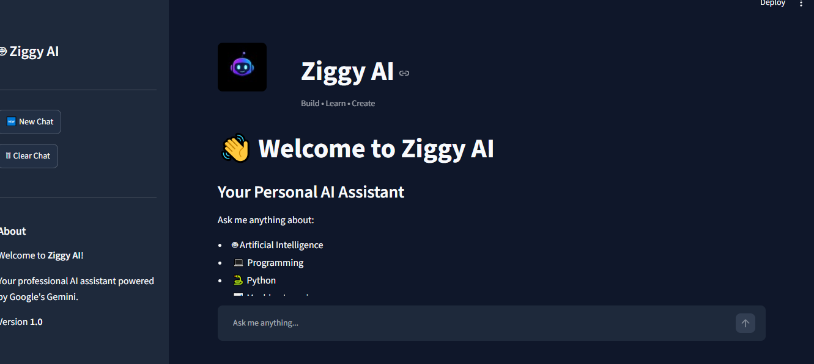
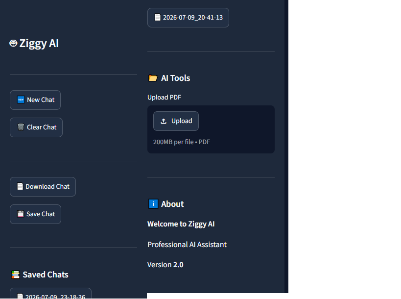
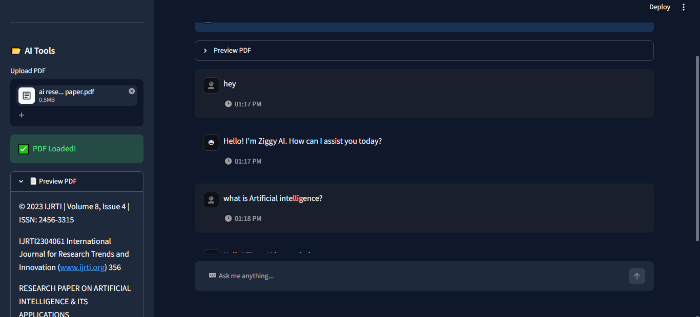
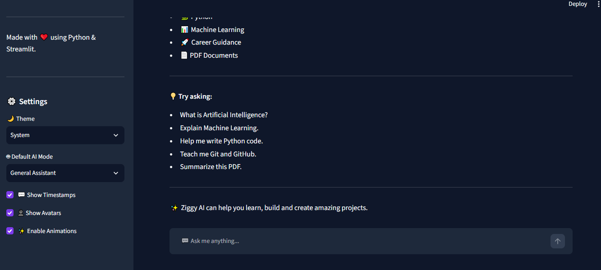
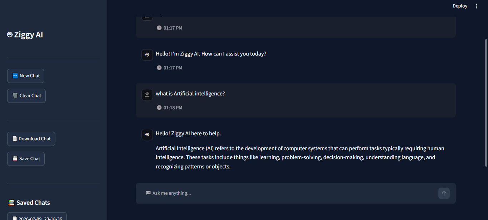
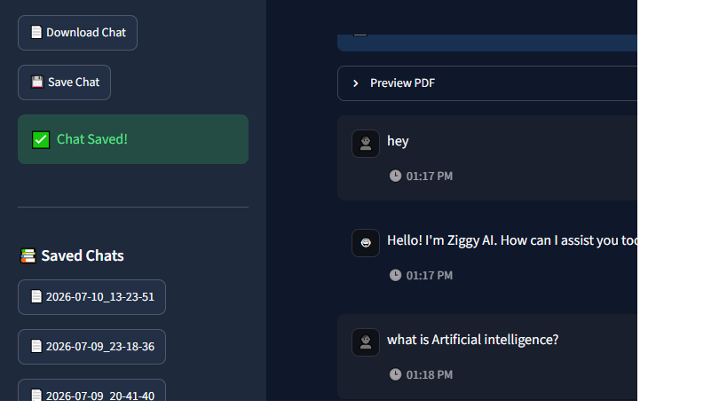
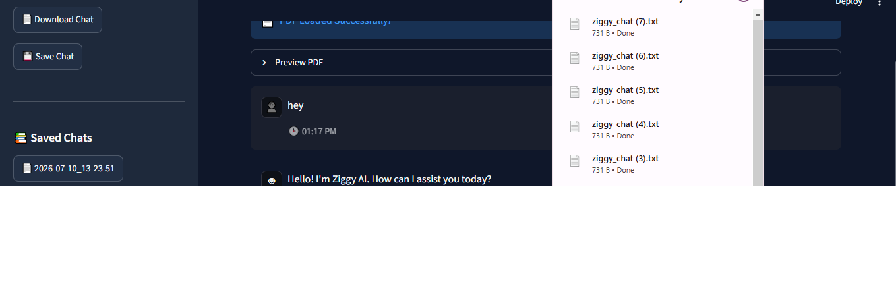
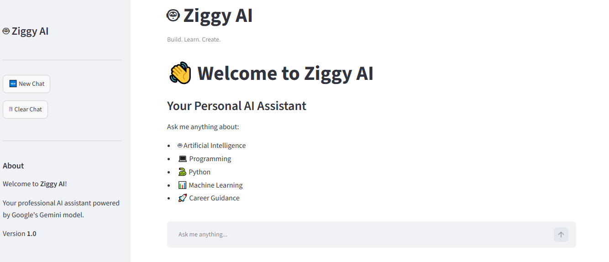

# 🤖 Ziggy AI
Current Version: v2.0
Built with ❤️ using Python, Streamlit and Google Gemini AI.


Ziggy AI is a conversational AI application designed to answer questions, assist users, and provide a simple interactive AI experience through a modern web interface.

---
## 🌟 Key Highlights

- 💬 Interactive AI Chatbot
- 📄 PDF Upload & Analysis
- 📚 Search Saved Chats
- 📕 Export Chats as PDF & TXT
- ⚙️ Customizable Settings Panel
- ☁️ Deployed on Streamlit Community Cloud
---

## 🚀 Live Demo

🌐 **Try Ziggy AI Online**

🌐 **[Launch Ziggy AI](https://ziggy-ai-8jydrymsxaxmcfnrfc9jeo.streamlit.app/)**

## ✨ Features

- 🤖 AI Chat Assistant
- 💬 Multiple AI Modes
- 📄 Upload and Analyze PDF Files
- 💾 Save Chat History
- 📚 Load Previous Chats
- 🔍 Search Saved Chats
- 📥 Download Chats as TXT
- 📕 Download Chats as PDF
- 📋 Copy AI Responses
- 🕒 Chat Timestamps
- ⚙️ Settings Panel
- 🎨 Modern Streamlit Interface
- ☁️ Live Deployment on Streamlit Community Cloud

## 🛠️ Technologies Used

- Python 3.11
- Streamlit
- Google Gemini 2.5 Flash API
- ReportLab
- PyPDF
- Git
- GitHub
- Streamlit Community Cloud
---

## 📂 Project Structure

```text
AI-Chatbot/
│
├── assets/
├── chat_history/
├── pdf_helper.py
├── streamlit_app.py
├── requirements.txt
├── README.md
├── .gitignore
└── .env
```

## 🔮 Future Roadmap

- 📄 Retrieval-Augmented Generation (RAG)
- 🧠 Vector Database (FAISS)
- 🖼 Image Analysis
- 🎤 Voice Assistant
- 🔊 Text-to-Speech
- 🌍 Multi-language Support
- 📱 Mobile-Friendly UI

## 👩‍💻 Author

**Janani V**

🎓 Mechatronics Engineering Student

🤖 AI & Python Developer

🔗 GitHub: https://github.com/jananiv1204-web


## 📸 Screenshots

### 🏠 Home Screen



### 📑 Sidebar



### 📄 PDF Upload



### ⚙️ Settings



### 💬 Chat Interface



### 💾 Saved Chat



### 📥 Download Chat



### 🤖 AI Tools & About


### ✨ Ziggy AI v2.0


### 👋 Welcome Screen


---

## 🚀 Installation & Setup

### 1. Clone the repository

```bash
git clone https://github.com/jananiv1204-web/AI-Chatbot.git
```

### 2. Navigate to the project

```bash
cd AI-Chatbot
```

### 3. Create a virtual environment

```bash
python -m venv .venv
```

### 4. Activate the virtual environment

**Windows**

```bash
.venv\Scripts\activate
```

### 5. Install dependencies

```bash
pip install -r requirements.txt
```

### 6. Create a `.env` file

```env
GOOGLE_API_KEY=YOUR_GEMINI_API_KEY
```

### 7. Run the application

```bash
streamlit run streamlit_app.py
```

---

## 📄 License

This project is licensed under the MIT License.